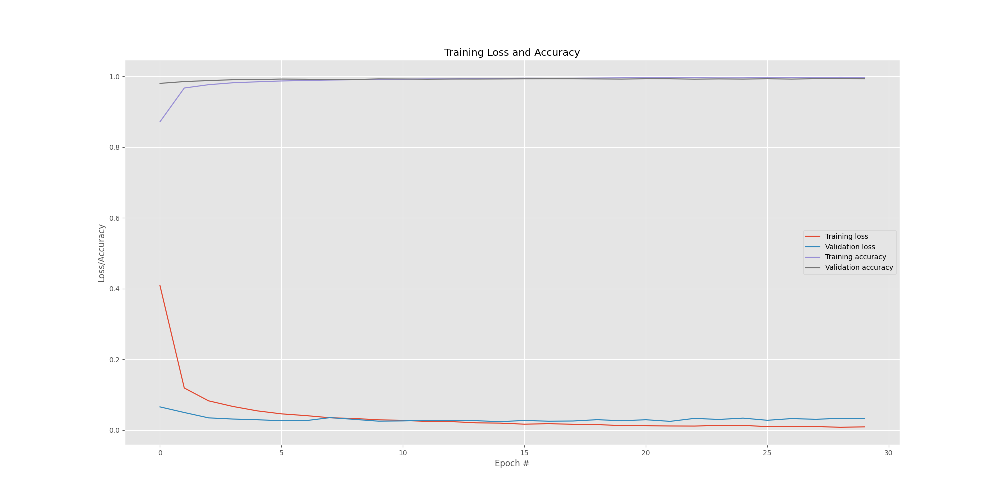
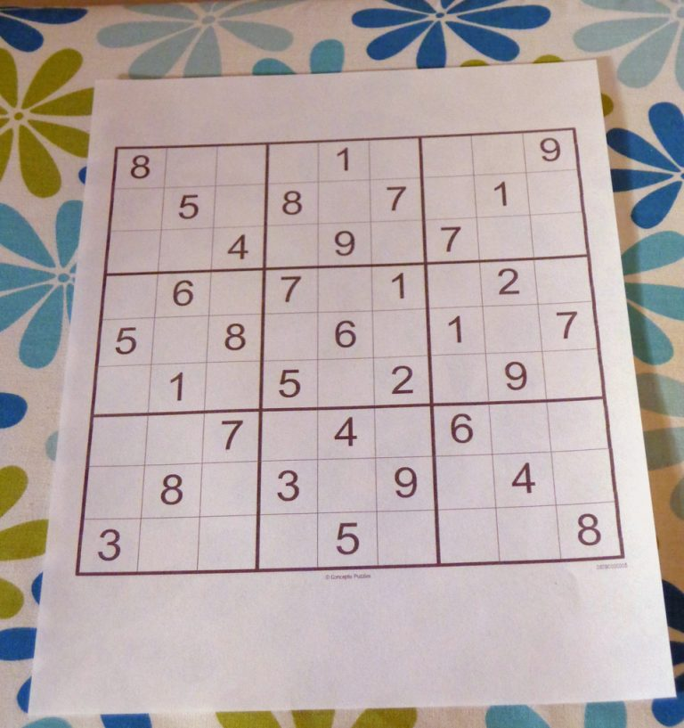

# Sudoku solution
 
I wanted to try something new, where I could take the topic even further. Now I'm trying to improve the model to work with other fonts using the [infiMNIST](https://leon.bottou.org/projects/infimnist) set (progress will be in the [dev](https://github.com/egorserdyuk/Sudoku-solution/tree/dev) branch). Created from lessons at [PyImageSearch](https://www.pyimagesearch.com/2020/08/10/opencv-sudoku-solver-and-ocr/).

I collected the usual metric - training loss and accuracy, validation loss and accuracy:

Example and result:

